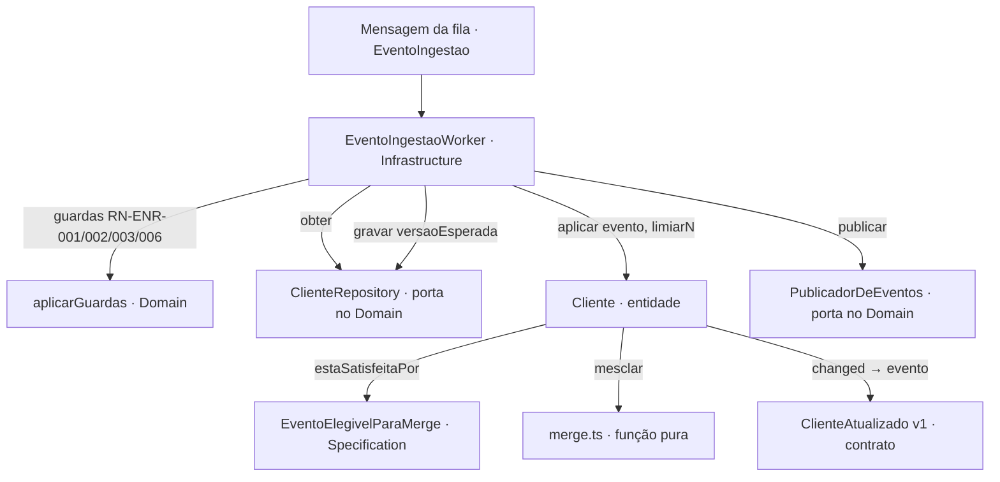

# Aplicar evento ao cadastro com limiar de completude (ENR-042) Design

**Spec**: `.specs/features/001-merge-por-unidade/spec.md`
**Status**: Approved

---

## Architecture Overview

Toda a regra vive na entidade `Cliente` e na specification `EventoElegivelParaMerge` (ADR-0003/0004). O merge por
unidade é uma função pura em `src/domain/cliente/service/merge.ts`; o evento publicado é um objeto imutável em
`src/domain/cliente/events/`; o worker só carrega, delega, grava condicionalmente e publica.

## Impacto

| Repo                                | Muda                                                                                                                                                                                                                | Contrato afetado                  | Ordem                               |
| ----------------------------------- | ------------------------------------------------------------------------------------------------------------------------------------------------------------------------------------------------------------------- | --------------------------------- | ----------------------------------- |
| enrichment-lab — presente           | `Cliente.aplicar` (substitui `substituir`), specification, `merge.ts`, evento v1, porta de publicação + adaptador em memória, worker, `docs/regras/enriquecimento.md` (RN-ENR-004), `asyncapi.yaml` (já lista o v1) | `ClienteAtualizado` v1 — **novo** | 1º (este repo é dono)               |
| CRM (consumidor) — **não presente** | consome `ClienteAtualizado`                                                                                                                                                                                         | —                                 | 2º, feature separada no repo do CRM |

Achados: o esqueleto já tem `achatar`/`aninhar` (unidades folha), `Unidade {valor, instante, origem}` anotada, `RN-ENR-005`
(gravação condicional com releitura) e o log de `ruleId` no worker — o merge só precisa devolver `changed` e os eventos.
Não há fila de saída: o publicador é uma porta com adaptador em memória (`PublicadorMemoria`), suficiente para o teste de
integração observar o evento.

---

## Code Reuse Analysis

### Existing Components to Leverage

| Component                                    | Location                                           | How to Use                                             |
| -------------------------------------------- | -------------------------------------------------- | ------------------------------------------------------ |
| `Unidade`, `Cliente.reidratar/novo/snapshot` | `src/domain/cliente/cliente.entity.ts`             | `aplicar` opera sobre `unidades`                       |
| `achatar`, `aninhar`                         | `src/domain/cliente/unidades.ts`                   | evento → unidades folha                                |
| `ehProvedor`                                 | `src/domain/cliente/interfaces/evento-ingestao.ts` | ING-04/ING-05                                          |
| `DomainRuleViolation(ruleId, motivo)`        | `src/domain/errors/domain-rule-violation.ts`       | recusa ING-05                                          |
| `EventoIngestaoWorker.gravarComRetry`        | `src/infrastructure/messaging/worker.ts`           | troca `substituir` por `aplicar`; publica se `changed` |
| `lerEnv().limiarN`                           | `src/infrastructure/config/env.ts`                 | N                                                      |

### Integration Points

| System       | Integration Method                                                                            |
| ------------ | --------------------------------------------------------------------------------------------- |
| CRM          | consome `ClienteAtualizado` v1 — fora desta spec; contrato definido aqui e em `asyncapi.yaml` |
| Persistência | `ClienteRepository` (memória) — gravação condicional já existente                             |

---

## Components

### `src/domain/cliente/events/cliente-atualizado.v1.ts`

`interface ClienteAtualizadoV1 { type: 'ClienteAtualizado'; version: 1; documento; versao; occurredAt }` + `criarClienteAtualizadoV1(documento, versao, agora)`. Mudar campo = `cliente-atualizado.v2.ts` (AD-001).

### `src/domain/cliente/messaging/publicador.port.ts`

`interface PublicadorDeEventos { publicar(evento: ClienteAtualizadoV1): Promise<void> }`; adaptador `src/infrastructure/memory/publicador.memoria.ts` (guarda em array; `limpar()`).

### `src/domain/cliente/specifications/evento-elegivel-para-merge.ts`

`estaSatisfeitaPor(cliente, evento, limiarN): { ok: true } | { ok: false; motivo: 'descartado-limiar' }` — ING-05: `!ehProvedor(origin) && cliente.quantidadeDeCampos >= N && unidadesDoEvento < N`.

### `src/domain/cliente/service/merge.ts`

`mesclar(atuais: Map<Caminho, Unidade>, evento): { unidades: Map; changed: boolean }` — ING-02/03/04: para cada unidade do evento (inclui `apto` como `apto`): ausente → entra; presente → entra se `evento.updatedAt > atual.instante` e (evento não é provedor ou atual.origem é provedor); `changed` = alguma unidade mudou de valor (comparação estrutural). Anotação sempre com instante e origem do evento vencedor.

### `Cliente.aplicar(evento, limiarN): { changed: boolean; eventos: ClienteAtualizadoV1[] }`

Specification → mesclar → se `changed`, troca as unidades e acumula um `ClienteAtualizado` (com a versão que a gravação vai atribuir: `versao + 1`); `substituir` é removido.

### Worker

`gravarComRetry`: `aplicar`; se `!changed` → não grava, registra processado, ack (resultado `'sem-mudanca'`); se `changed` → `gravar(versaoEsperada)` e `publicar` cada evento.

---

## Error Handling Strategy

| Error Scenario     | Handling                                                                                     | User Impact                          |
| ------------------ | -------------------------------------------------------------------------------------------- | ------------------------------------ |
| Limiar (ING-05)    | `DomainRuleViolation('RN-ENR-004','descartado-limiar')` → worker loga `ruleId`/`motivo`, ack | evento descartado, rastreável no log |
| Conflito de versão | RN-ENR-005: releitura + `aplicar` de novo                                                    | transparente                         |
| Falha técnica      | devolve à fila; DLQ após 5                                                                   | operação vê a DLQ                    |

---

## Tech Decisions

| Decision                          | Choice                                                       | Alternatives rejected                            | Why                                                                                     |
| --------------------------------- | ------------------------------------------------------------ | ------------------------------------------------ | --------------------------------------------------------------------------------------- |
| Onde fica a recência/proveniência | função pura `merge.ts` chamada pela entidade                 | dentro do worker                                 | ADR-0004; testável sem fila                                                             |
| Versão no evento publicado        | `versao + 1` calculada na entidade, confirmada pela gravação | publicar depois de gravar com a versão devolvida | a entidade decide; o worker não recalcula; a gravação condicional garante que é a mesma |
| `apto`                            | unidade `apto` no mapa                                       | campo à parte                                    | uma regra só (ING-03/04)                                                                |
| Publicador                        | porta + memória                                              | fila de saída real                               | fora do laboratório; `asyncapi.yaml` é o contrato                                       |
