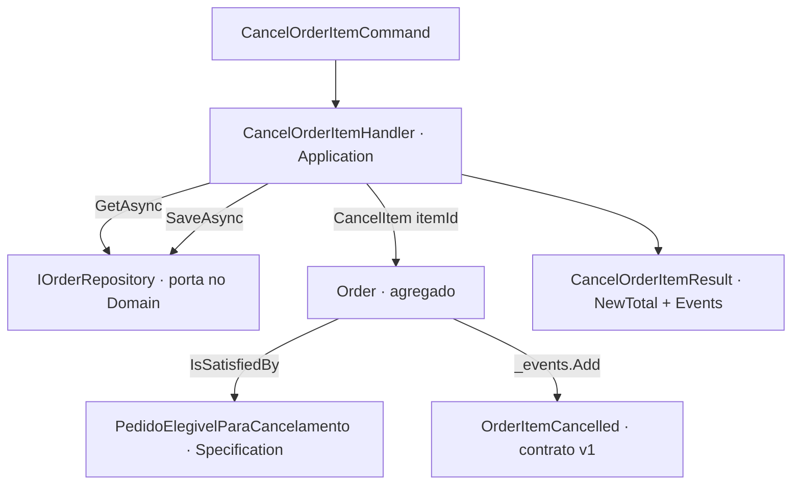

# Cancelamento parcial de pedido (ORD-231) Design

**Spec**: `.specs/features/001-cancelamento-parcial/spec.md`
**Status**: Approved

---

## Architecture Overview

Toda a regra vive no agregado `Order` (ADR-0003/0004). A elegibilidade é uma `ISpecification<Order>`; o evento é um record
imutável em `Orders.Domain.Events`; o handler em `Orders.Application` só carrega, delega, persiste e devolve.



## Impacto (saída do agente `kit:impact-analyzer`, 2026-08-29)

| Repo | Muda | Contrato afetado | Ordem |
| ---- | ---- | ---------------- | ----- |
| orders-sample (Orders) — presente | `Order.CancelItem`, specification, evento, handler, `docs/regras/pedidos.md` (RN-ORD-012) | `OrderItemCancelled` v1 — **novo, aditivo** | 1º contrato, 2º produtor, 3º application |
| erp-mono (ERP legado, estoque) — **não presente** | consome o evento e libera a reserva, atrás de flag | — | 4º, **feature separada no repo do ERP** (fora desta spec) |

Achados do agente incorporados: `OrderItem.Cancel()` e `Order.Total` já ignoram itens cancelados (gancho pronto, ninguém chama);
**não há dispatcher/outbox** — `Order.Events` é acumulado e nunca publicado; `src/Erp.Legacy` deste repo não é o ERP do card
(só `CalculadoraFrete`); não há catálogo AsyncAPI para registrar o schema. Ver "Tech Decisions".

---

## Code Reuse Analysis

### Existing Components to Leverage

| Component | Location | How to Use |
| --------- | -------- | ---------- |
| `IDomainEvent` | `src/Orders.Domain/Events/IDomainEvent.cs` | o evento implementa |
| `ISpecification<T>` | `src/Orders.Domain/Specifications/ISpecification.cs` | a specification implementa |
| `OrderItem.Cancel()` (internal), `OrderItem.Cancelled` | `src/Orders.Domain/OrderItem.cs` | `CancelItem` chama; `Total` já ignora cancelados |
| `Money` (+, Brl) | `src/Orders.Domain/Money.cs` | `NewTotal` |
| `DomainRuleViolationException(ruleId, message)` | `src/Orders.Domain/DomainRuleViolationException.cs` | recusas com `RuleId = "RN-ORD-012"` |
| `IOrderRepository` / `InMemoryOrderRepository` | `src/Orders.Domain/IOrderRepository.cs`, `src/Orders.Infrastructure/` | handler e teste de integração |
| `ArchitectureTests` | `tests/Orders.Tests/ArchitectureTests.cs` | continua impondo ADR-0003/0004 |

### Integration Points

| System | Integration Method |
| ------ | ------------------ |
| ERP (estoque) | consome `OrderItemCancelled` — fora desta spec; contrato v1 definido aqui |
| Persistência | `IOrderRepository` (in-memory no exemplo) |

---

## Components

### OrderItemCancelled (evento, contrato v1)
- **Purpose**: Sinalizar que um item foi cancelado e qual é o novo total do pedido.
- **Location**: `src/Orders.Domain/Events/OrderItemCancelled.cs`
- **Interfaces**: `record OrderItemCancelled(Guid OrderId, Guid ItemId, Money NewTotal) : IDomainEvent { DateTimeOffset OccurredAt }`
- **Dependencies**: `IDomainEvent`, `Money`
- **Reuses**: padrão de record imutável (AD-001)

### PedidoElegivelParaCancelamento (specification)
- **Purpose**: Predicado reutilizável: só pedido `Aberto` admite cancelamento de item (CANC-06).
- **Location**: `src/Orders.Domain/Specifications/PedidoElegivelParaCancelamento.cs`
- **Interfaces**: `bool IsSatisfiedBy(Order candidate)`
- **Dependencies**: `OrderStatus`
- **Reuses**: `ISpecification<T>` (AD-002)

### Order.CancelItem (agregado)
- **Purpose**: Impor RN-ORD-012: elegibilidade, item pertence ao pedido, marcar cancelado, recalcular, emitir um evento, idempotente.
- **Location**: `src/Orders.Domain/Order.cs`
- **Interfaces**: `void CancelItem(Guid itemId)`
- **Dependencies**: specification, `OrderItem.Cancel()`, `_events`
- **Reuses**: `Total` (já ignora cancelados)

### CancelOrderItemHandler (application)
- **Purpose**: Orquestrar sem decidir (CANC-07): carregar, delegar ao domínio, persistir, devolver.
- **Location**: `src/Orders.Application/CancelOrderItem/CancelOrderItemHandler.cs`
- **Interfaces**: `Task<CancelOrderItemResult> HandleAsync(CancelOrderItemCommand, CancellationToken)`
- **Dependencies**: `IOrderRepository`
- **Reuses**: padrão "carrega → domínio → salva"; `KeyNotFoundException` para pedido inexistente (não é regra de negócio)

---

## Data Models

```csharp
public sealed record OrderItemCancelled(Guid OrderId, Guid ItemId, Money NewTotal) : IDomainEvent
{ public DateTimeOffset OccurredAt { get; init; } = DateTimeOffset.UtcNow; }

public sealed record CancelOrderItemCommand(Guid OrderId, Guid ItemId);
public sealed record CancelOrderItemResult(Money NewTotal, IReadOnlyList<OrderItemCancelled> Events);
```

**Relationships**: `OrderItemCancelled.OrderId` → `Order.Id`; `ItemId` → `OrderItem.Id`.

---

## Error Handling Strategy

| Error Scenario | Handling | User Impact |
| -------------- | -------- | ----------- |
| Pedido Faturado ou Cancelado (CANC-03/06) | `DomainRuleViolationException("RN-ORD-012", …)` lançada pelo agregado; nada muda | recusa explícita com o ID da regra |
| Item não pertence ao pedido (CANC-05) | idem, `RuleId` RN-ORD-012 | recusa explícita |
| Item já cancelado (CANC-04) | no-op silencioso; nenhum evento novo | idempotente |
| Pedido inexistente (handler) | `KeyNotFoundException` (não é regra de negócio; ADR-0004) | 404 na borda, quando houver API |

---

## Tech Decisions

| Decision | Choice | Alternatives rejected | Why |
| -------- | ------ | --------------------- | --- |
| Onde vive a elegibilidade | `ISpecification<Order>` no domínio | `if (order.Status == …)` no handler | ADR-0004; teste de arquitetura falha; reutilizável em consulta (AD-002) |
| Payload do evento | `OrderId`, `ItemId`, `NewTotal`, `OccurredAt` | incluir `Sku` (sugestão do impact-analyzer) | mínimo que o consumidor precisa; adicionar campo depois = versionar; `Sku` não é exigido pelo card |
| Publicação dos eventos | **fora desta feature** — `Order.Events` continua acumulado | outbox/dispatcher agora | não há broker nem API no exemplo; registrado como risco e como assumption; feature própria quando houver transporte |
| Pedido com todos os itens cancelados | permanece `Aberto` com total 0,00 | transitar para `Cancelado` | não especificado no card; não inventar regra (assumption na spec) |

Decisões de projeto (cross-feature) registradas em `.specs/STATE.md`: AD-001 (eventos públicos imutáveis, mudar = versionar), AD-002 (elegibilidade por specification).
